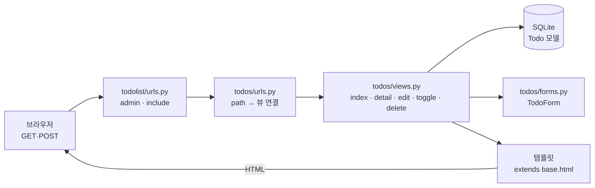

# django-crud — 전체 플로우

**읽는 법**

- **왼쪽 → 오른쪽**이 요청이 지나는 순서이고, 템플릿에서 렌더한 HTML이 다시 **브라우저**로 돌아갑니다.
- **DB / TodoForm / 템플릿**은 뷰가 같은 단계에서 공유하는 자원입니다.

---

### URL → 뷰 (CRUD 보조)

| 경로 | 뷰 | 하는 일 |
|------|-----|---------|
| `""` | `index` | 목록, 새 할 일 추가(Create) |
| `"<pk>/"` | `detail` | 한 건 조회(Read) |
| `"<pk>/edit/"` | `edit_todo` | 제목 수정(Update) |
| `"<pk>/toggle/"` | `toggle_completed` | 완료 여부(Update) |
| `"<pk>/delete/"` | `delete_todo` | 삭제(Delete) |

표는 그림과 겹치지 않게 **보조**만 합니다.
